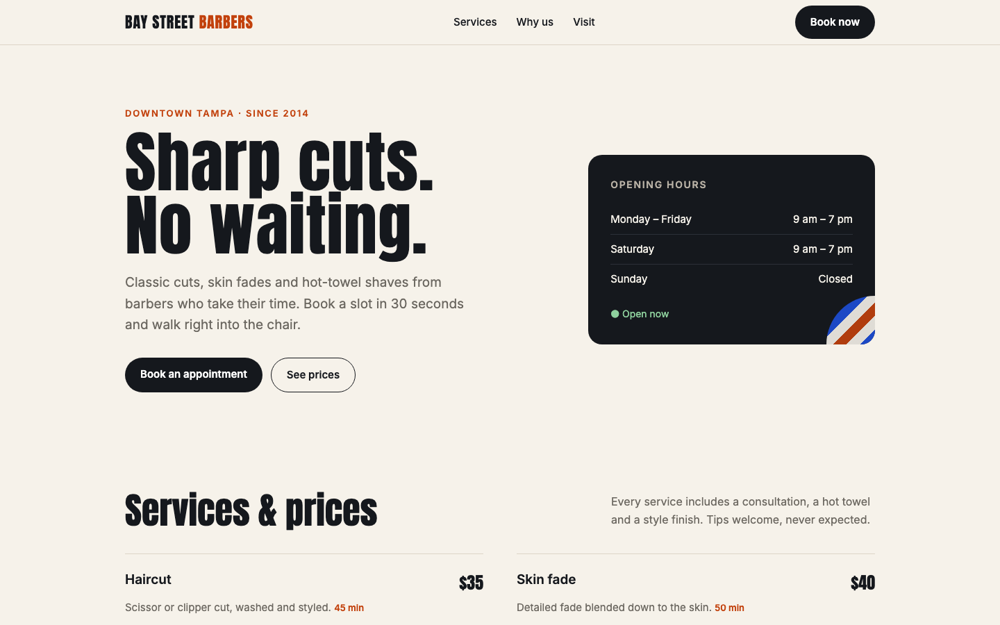
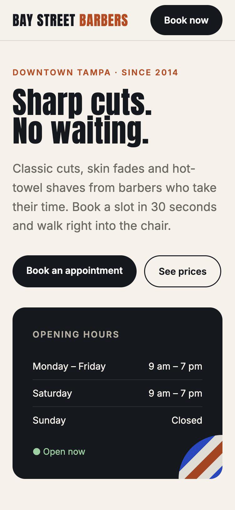

# Landing page for a local business

A fast, single-file landing page for a (fictional) Tampa barbershop. No
framework, no build step: one `index.html` that loads in well under a second and
can be hosted for free on GitHub Pages, Netlify or Cloudflare Pages.

**Live demo: https://alexp-automation.github.io/barbershop-landing/**





## What's in it

- Hero with clear call to action, live "Open now / Closed" badge in Tampa time
- Services and prices, a short "why us" block, location and hours
- Booking form with validation: no past dates, Sundays blocked, half-hour slots,
  phone number check. In a real project it posts to email, Google Sheets, a CRM
  or the [Telegram booking bot](https://github.com/alexp-automation/telegram-booking-bot)
- Responsive down to 360 px, sticky header, accessible labels and focus states
- SEO basics: title, meta description, semantic sections

## Run locally

```bash
python3 -m http.server 8000
# open http://localhost:8000
```
